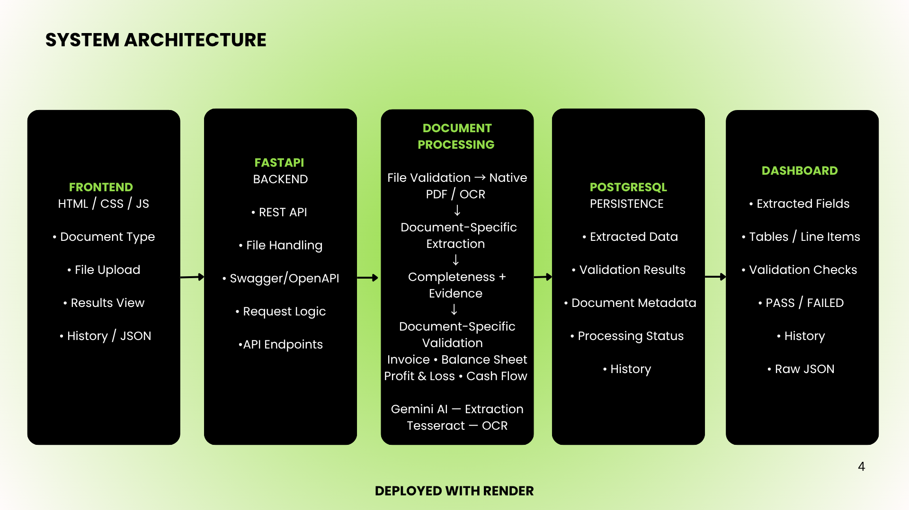

# Document Intelligence Platform

An end-to-end AI-powered financial document extraction and validation platform built for the AI Engineer Internship case study.

The application accepts financial documents in PDF, JPG, and PNG formats, validates the input, extracts structured information using OCR plus Gemini multimodal extraction, performs deterministic financial checks, persists the result, and presents the result through a web dashboard.

## Live Deployment

- **Frontend:** https://document-intelligence-x363.onrender.com/
- **Backend/API:** https://document-intelligence-x363.onrender.com
- **Swagger/OpenAPI:** https://document-intelligence-x363.onrender.com/docs
- **Health check:** https://document-intelligence-x363.onrender.com/api/v1/health
- **GitHub:** https://github.com/c639-afk/document-intelligence

The frontend and API are served by the same deployed application.

## Supported Documents

The API supports four financial document types:

1. `invoice`
2. `balance_sheet`
3. `profit_and_loss`
4. `cash_flow_statement`

Supported file formats:

- PDF
- JPG/JPEG
- PNG

Documents are limited to **3 pages**.

## System Architecture



### Architecture Flow

**Frontend → FastAPI → Document Processing → PostgreSQL → Dashboard**

The document processing layer performs file validation, native PDF extraction or OCR, document-specific Gemini extraction, completeness and evidence handling, and deterministic financial validation.

The system supports four document types:
- Invoice
- Balance Sheet
- Profit & Loss
- Cash Flow Statement

Gemini is used for structured extraction, while Tesseract is used for scanned/image-based OCR.

## Documentation

- [Solution Presentation](docs/solution_presentation.pdf)
- [System Architecture](docs/architecture.png)

## Processing Pipeline

### 1. Document validation

Before AI extraction, the uploaded document is checked for:

- Supported file type
- Supported extension
- Readability / corruption
- PDF page count
- Maximum page limit of 3 pages
- Basic file integrity

Invalid documents return a structured API error without calling Gemini.

### 2. OCR and text extraction

- JPG/PNG files are processed with **Tesseract OCR**.
- PDFs are first processed using native PDF text extraction through `pypdf`.
- If a PDF does not contain enough native text, the pages are rendered with `pdf2image` and processed with Tesseract OCR.
- Page-level text is retained as supporting context.

### 3. Multimodal Gemini extraction

The original document is sent to Gemini together with the extracted page context.

Gemini extracts meaningful visible information without intentionally inventing missing values.

The common structured extraction schema contains:

- Document type
- Named fields
- Invoice line items
- Financial tables
- Evidence/source text where available
- Page numbers where available

Missing values are represented as `null`.

The extraction service uses the configured primary Gemini model and a fallback Gemini model. Gemini quota errors are surfaced as HTTP 429 responses rather than repeatedly retrying an exhausted daily quota.

### 4. Financial validation

Financial validation is deterministic Python logic rather than an LLM-generated calculation.

A tolerance of **0.01** is used for numeric reconciliation.

The validator returns:

- Check name
- Formula
- Input values
- Calculated value
- Reported value
- Variance
- Status: `PASS`, `FAIL`, or `NOT_APPLICABLE`

Validation is implemented independently for:

#### Invoice

- Subtotal + tax - discount ≈ total
- Quantity × unit price ≈ line amount
- Sum of line amounts ≈ subtotal
- Subtotal × tax rate ≈ tax when a single consistent tax rate is available

#### Balance Sheet

- Assets ≈ capital + liabilities
- Component-level reconciliation where sufficient values are available
- Comparative periods are handled where extracted

#### Profit and Loss

- Interest Earned + Other Income ≈ Total Income
- Interest Expended + Operating Expenses + Provisions & Contingencies ≈ Total Expenditure
- Total Income - Total Expenditure ≈ Consolidated Net Profit before Minority Interest
- Profit before Minority Interest - Minority Interest ≈ Consolidated Net Profit attributable to Group
- Appropriations are checked when applicable
- Comparative periods are handled where extracted

#### Cash Flow Statement

- Operating + investing + financing + FX/translation ≈ net increase
- Opening cash + net increase + adjustments ≈ closing cash
- Parenthesized values are interpreted as negative numbers
- Comparative periods are handled where extracted

Checks for which the required information is unavailable return `NOT_APPLICABLE` rather than inventing values.

### 5. Persistence

Processed results are stored through SQLAlchemy.

The project supports:

- SQLite for local development/testing
- PostgreSQL for deployment

Each stored document contains the document name, type, processing status, file validation metadata, and the complete structured result JSON.

Processing a document with an existing name updates the stored result for that document.

## API

### Process a document

```http
POST /api/v1/documents/process
```

Multipart form fields:

- `file` — PDF/JPG/PNG document
- `document_type` — one of:
  - `invoice`
  - `balance_sheet`
  - `profit_and_loss`
  - `cash_flow_statement`

Example:

```bash
curl -X POST \
  "https://document-intelligence-x363.onrender.com/api/v1/documents/process" \
  -F "file=@invoice.jpg" \
  -F "document_type=invoice"
```

### List processed documents

```http
GET /api/v1/documents
```

Returns document history including:

- Document name
- Document type
- Processing status
- Processing timestamp
- Page count

Example:

```bash
curl "https://document-intelligence-x363.onrender.com/api/v1/documents"
```

### Retrieve a processed document

```http
GET /api/v1/documents/{document_name}
```

Example:

```bash
curl "https://document-intelligence-x363.onrender.com/api/v1/documents/invoice.jpg"
```

### Health

```http
GET /api/v1/health
```

Example response:

```json
{
  "status": "healthy",
  "service": "document-intelligence-api"
}
```

### Interactive API documentation

Swagger UI is available at:

`https://document-intelligence-x363.onrender.com/docs`

## API Response Structure

A successful processing response follows this general structure:

```json
{
  "document_name": "invoice.jpg",
  "document_type": "invoice",
  "processing_status": "PASS",
  "file_validation": {
    "file_type": "image/jpeg",
    "is_supported": true,
    "is_readable": true,
    "page_count": 1
  },
  "extracted_data": {
    "document_type": "invoice",
    "fields": [],
    "line_items": [],
    "tables": []
  },
  "validation": {
    "checks": [],
    "overall_status": "PASS",
    "issues": []
  },
  "extraction_issues": [],
  "processing_metadata": {
    "ocr_used": true,
    "multimodal_extraction": true,
    "processed_at": "...",
    "processing_time_ms": 1234.56
  }
}
```

The actual `fields`, `line_items`, `tables`, and validation checks depend on the uploaded document.

## Frontend

The dashboard provides:

- Document type selection
- File upload
- API connection status
- Processing status
- File validation information
- OCR usage
- Processing time
- Extracted fields
- Invoice line items
- Extracted financial tables
- Financial validation results
- Validation issues
- Extraction issues
- Expandable raw JSON
- Processing history

Missing extracted values are visually highlighted.

Failed validation checks are highlighted separately from successful checks.

## Project Structure

```text
document-intelligence/
├── backend/
│   ├── app/
│   │   ├── api/
│   │   │   └── routes/
│   │   │       └── documents.py
│   │   ├── core/
│   │   │   ├── config.py
│   │   │   └── database.py
│   │   ├── models/
│   │   │   └── document.py
│   │   ├── repositories/
│   │   │   └── document_repository.py
│   │   ├── schemas/
│   │   │   ├── document.py
│   │   │   └── extraction.py
│   │   ├── services/
│   │   │   ├── document_validation_service.py
│   │   │   ├── invoice_extraction_service.py
│   │   │   ├── invoice_validation_service.py
│   │   │   ├── balance_sheet_extraction_service.py
│   │   │   ├── balance_sheet_validation_service.py
│   │   │   ├── profit_loss_extraction_service.py
│   │   │   ├── profit_loss_validation_service.py
│   │   │   ├── cash_flow_extraction_service.py
│   │   │   ├── cash_flow_validation_service.py
│   │   │   └── ocr_service.py
│   │   └── main.py
│   ├── tests/
│   │   ├── test_api.py
│   │   ├── test_financial_validation.py
│   │   └── test_validation.py
│   ├── .env.example
│   └── requirements.txt
├── frontend/
│   ├── static/
│   │   ├── css/style.css
│   │   └── js/app.js
│   └── templates/
│       └── index.html
├── docs/
├── sample_outputs/
├── Dockerfile
└── .gitignore
```

## Tech Stack

### Backend

- Python 3.13
- FastAPI
- Uvicorn
- Pydantic
- SQLAlchemy

### AI / Document Processing

- Google Gemini API
- `google-genai`
- Tesseract OCR
- `pytesseract`
- `pypdf`
- `pdf2image`
- Pillow

### Database

- SQLite for local development/testing
- PostgreSQL for deployment
- SQLAlchemy ORM
- `psycopg`

### Frontend

- HTML
- CSS
- Vanilla JavaScript

### Deployment

- Docker
- Render

## Local Setup

### 1. Clone the repository

```bash
git clone https://github.com/c639-afk/document-intelligence.git
cd document-intelligence
```

### 2. Create and activate a virtual environment

```bash
python3 -m venv .venv
source .venv/bin/activate
```

### 3. Install Python dependencies

```bash
pip install -r backend/requirements.txt
```

The application also requires:

- Tesseract OCR
- Poppler

On macOS these can be installed with Homebrew:

```bash
brew install tesseract poppler
```

### 4. Configure environment variables

Create:

```text
backend/.env
```

based on:

```text
backend/.env.example
```

Required configuration:

```env
GEMINI_API_KEY=your_gemini_api_key_here
GEMINI_MODEL=gemini-3.6-flash
GEMINI_FALLBACK_MODEL=gemini-3.5-flash
```

For PostgreSQL deployment, also set:

```env
DATABASE_URL=your_postgresql_connection_string
```

Do not commit `.env` or API keys to GitHub.

### 5. Start the API

From the repository root:

```bash
cd backend
uvicorn app.main:app --reload
```

The local API will be available at:

```text
http://127.0.0.1:8000
```

Swagger:

```text
http://127.0.0.1:8000/docs
```

Health:

```text
http://127.0.0.1:8000/api/v1/health
```

Frontend:

```text
http://127.0.0.1:8000/
```

## Docker

The repository contains a root-level `Dockerfile`.

It installs:

- Python dependencies
- Tesseract OCR
- Poppler

Build:

```bash
docker build -t document-intelligence .
```

Run:

```bash
docker run \
  -p 8000:8000 \
  -e GEMINI_API_KEY="your_key" \
  -e GEMINI_MODEL="gemini-3.6-flash" \
  -e GEMINI_FALLBACK_MODEL="gemini-3.5-flash" \
  -e DATABASE_URL="your_database_url" \
  document-intelligence
```

## Testing

The test suite covers:

- Document validation
- Financial validation
- API endpoints and error handling

Run:

```bash
cd backend
pytest -q
```

The current project test suite contains **24 tests**, covering the implemented validation and API behavior.

The suite can run without consuming Gemini API quota because the tests focus on the validation/API layers rather than making live Gemini extraction requests.

## Error Handling

Invalid documents are rejected before extraction.

Examples include:

- Unsupported file type
- Invalid or unreadable document
- PDF exceeding the page limit
- Processing failure

Gemini daily quota exhaustion is returned as:

```http
429 Too Many Requests
```

with an application error code:

```json
{
  "error": {
    "code": "GEMINI_QUOTA_EXCEEDED",
    "message": "Gemini API daily limit reached. Please try again after the quota resets."
  }
}
```

## Environment and Secrets

The repository includes `.env.example` only.

Actual credentials are intentionally excluded from Git:

```text
.env
*.env
```

The deployment environment supplies the Gemini API key and PostgreSQL connection string through environment variables.

## Design Decisions

### Deterministic financial validation

Financial calculations are performed in Python using `Decimal` rather than asking the LLM to calculate validation results. This makes the validation reproducible and auditable.

### Evidence and page tracking

The extraction schema allows fields and table values to retain source evidence and page numbers where available. This provides traceability from structured output back to the source document.

### Conservative handling of missing data

The extraction schema represents unavailable values as `null`. Validation checks become `NOT_APPLICABLE` when the required values are unavailable instead of inventing or estimating financial figures.

### Native PDF text before OCR

For PDFs, native text extraction is attempted first. OCR is used when the native PDF contains insufficient text, allowing both digital and scanned PDFs to be handled.

### Persistence

Processed results are persisted so that a document can be retrieved later through the API and displayed in processing history.

## Assumptions

- The document type is selected by the user; automatic document classification is not required.
- Documents contain at most 3 pages.
- Supported inputs are PDF, JPG/JPEG, and PNG.
- Missing or unreadable values are represented as `null` rather than inferred.
- Reprocessing the same document name updates the latest stored result.

## Current Limitations

- Gemini extraction requires an available Gemini API quota.
- LLM extraction quality depends on document image quality, layout, and legibility.
- Financial validation is intentionally conservative when required values are missing or ambiguous.
- The application is designed for documents of up to 3 pages as required by the case study.
- The deployed service uses a free-tier hosting configuration and may experience cold starts or resource limitations.

## Production Improvements

For a production deployment, I would:

- Add authentication and authorization
- Add API rate limiting
- Move long-running document processing to background workers
- Add centralized logging, metrics, tracing, and alerting
- Use production-grade API quotas and infrastructure
- Add broader regression datasets and extraction accuracy benchmarks
- Add document versioning and audit trails where required

## AI-Assisted Development

AI coding assistants were used during development for debugging, troubleshooting, code review, extraction-prompt refinement, validation logic refinement, and documentation support.

All AI-generated suggestions were reviewed, tested, and adapted manually. The final implementation, testing, deployment, and verification were performed by the candidate.

## Submission Checklist

- [x] PDF/JPG/PNG input
- [x] Document validation
- [x] Native and scanned PDF handling
- [x] OCR support
- [x] Gemini multimodal extraction
- [x] Structured JSON output
- [x] Invoice extraction and line items
- [x] Balance sheet validation
- [x] Profit & loss validation
- [x] Cash flow validation
- [x] Financial reconciliation checks
- [x] Persistence
- [x] Retrieve by document name
- [x] Processing history
- [x] Web dashboard
- [x] REST API
- [x] Swagger/OpenAPI
- [x] Health endpoint
- [x] Automated tests
- [x] Docker deployment
- [x] Public GitHub repository
- [x] Secrets excluded from repository

## License

This project was developed as an internship case study submission.
